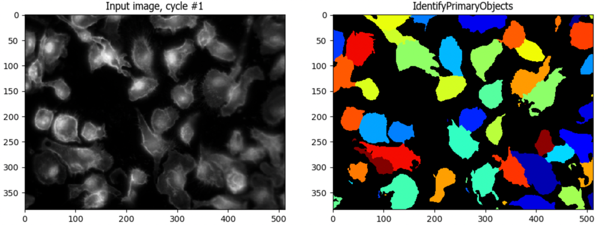

# Image Processing and Basic Segmentation

*Lab authors: Hunter Elliott, Marcelo Cicconet, & Beth Cimini* . 

<small>This file last updated 2024-04-05.</small>

---

## Learning Objectives

- Experimenting with filtering
- Get experience with CellProfiler{cite}`Stirling2021-sg`
- Bonus: Detecting edges and ridges
- Bonus: Using encapsulated segmentation modules in CellProfiler

Lab Data: [<u>https://tinyurl.com/qi2024labs</u>](https://tinyurl.com/qi2024labs)

---

## **Edge Filtering & Edge Detection**

*The goal here is to detect at least some of the edges between the cells
using what you've learned about derivative filters.*

### Edge detection in Fiji

```{note} 
You will need to have the FeatureJ plugin installed for these exercises. If it's not, check the first analysis lab handout for instructions on how to do it. |
```

- Open the `Image_Processing/Neurons/4_9_13_AVG_Aligned_Stack`.tif image

  - Why will thresholding not work on this image?

- Experiment with first partial derivatives:

  - Go to Plugins-\>FeatureJ-\>FeatureJ derivatives

  - Which order derivative will detect edges? Select this order
    derivative in the X direction and look at the result - why does this
    make sense?

  - Do the same in the Y direction, and compare which features in the
    image are highlighted.

  - Adjust the “smoothing scale” parameter and see how the result
    changes. What is this setting doing to the filter kernel?

- Experiment with edge filtering

  - Go to Plugins-\>FeatureJ-\>FeatureJ Edges

  - Make sure only the “compute gradient magnitude image” box is
    checked, select a “smoothing scale” and then click OK. Look at the
    resulting image and compare to the original image and the partial
    derivatives you calculated before.

  - Try different smoothing scales - which features produce the
    strongest response at larger scales? At smaller scales?

- Experiment with edge detection

  - Go to Plugins-\>FeatureJ-\>FeatureJ Edges

  - Check the “suppress non-maximum gradients” box and click OK. Look at
    the resulting image, and compare it to the previous edge filter
    image - how is it different?

  - Experiment with thresholding the non-maximum suppressed edge
    filtered image (Ctrl+Shift+T). Examine the values in the non-maximum
    suppressed edge image, and then decide on a good high and low
    threshold for edge detection. Then re-run the FeatureJ edges plugin,
    typing these thresholds into the lower and higher threshold boxes to
    perform Canny edge detection.

  - Look at your result. Overlay it on the original image. Where did
    your edge detector succeed? Where did it fail?

---

### Edge detection in CellProfiler

#### LoG filtering
- Open CellProfiler and load the same image (`Image_Processing/Neurons/4_9_13_AVG_Aligned_Stack`) in the Images panel (where it says **Drop files and folders here**)
- Load the `edge_detection_neurons.cppipe` pipeline file onto the left side pipeline panel (where it says **Drop a pipeline file here**)
- Enter test mode by hitting the `Start Test Mode` button  
- Execute the `EnhanceEdges` module by hitting the `Step` button  
- How does the LoG filter look? What happens when you change the Gaussian diameter size?

#### Canny edge detection
- Change to performing Canny edge finding by changing the selected method in `Select an edge finding method`
- Execute the module by pressing `Step` - what happens? 
- Play with manually setting your own thresholds by setting the automatic thresholding settings to `No` - are you able to find good values?
```{note}
  You may find your values are approximately a factor of ~250 off from the values you were using in Fiji - can you hypothesize what might be happening here?
```

---

## **Basic Segmentation**

As discussed in lecture, classical segmentation typically consists of a stereotyped set of steps
1. Smoothing
2. Thresholding
3. Filling holes in threshold masks
4. Local maxima detection in smoothed image
5. Watershed
6. Filling holes in detected objects

Here, we will demonstrate all these steps in CellProfiler, and let you play with how the parameters you choose to see how they affect the segmentation you get.

```{important}
There are two main ways to move around in CellProfiler once in test mode - keep 
- If you hit the `Step` button  , the next module (but only the next module) will run
- If you hit the `Run` button  , all the remaining modules will run (unless you've added a pause button somewhere)
```

### Load files
- Open a new CellProfiler window, or open a clean starting version by going to File -> New Project  
- Load the `Basic_Segmentation` folder into the Images module as above
  - This will load 3 sets of images, each with a DAPI image and and actin image
- Load the `basic_segmentation.cppipe` folder into the pipeline panel as above

```{note}
CellProfiler `.cppipe` files are just text files. You can open them in a basic text editor such as Notepad to see what's inside. It also makes them easily shareable with your labmates or even to attach as supplemental information on a paper.
```

- Enter test mode by hitting the `Start Test Mode` button  

```{tip}
Curious about how CellProfiler figures out that this is 3 sets of 2 channels each, and not 6 individual images or one 6 channel image? Look at the NamesAndTypes module!
```

### Smooth the images and find local maxima

- Run the `Smooth` module - without going nuts, how does your result change if you change the method? What about the smoothing diameter?
- Run the `FindMaxima` module to find local maxima in the smoothed image created above 
  - You may find it helpful to increase the maxima preview size. 
  - Is it clear how all of the settings control where maxima are found?

### Threshold and fill holes in the threshold masks

- Run the `Threshold` module on the smoothed image
- Run the `RemoveHoles` module on the thresholded image to remove any holes in the masks
  - If there aren't any holes, try setting the `Threshold Correction Factor` in the `Threshold` module to something like 1.1 or 1.2 (from 1.0) to create some
    - What do you think that setting may do, mathematically? 
    - Click the help button () to learn if you were right.

### Watershed into objects, and fill holes in the object masks

- Run the `Watershed` module to turn your masks into actual CellProfiler objects
- Run the `FillObjects` module to remove any holes that may remain in the objects themselves

### Evaluate your performance across multiple images

- It is **_critical_** when doing segmentation to evaluate your objects against your raw images - otherwise, you cannot be certain your preprocessing steps have not introduced errors. Run the `OverlayOutlines` module to see how you did.
  - If not well, where do you think you need to make changes?
- It is also **_critical_** to see if your settings work well across not just one image, but all of your images. Evaluate your performance on all 3 image sets.
```{tip}
To move between image sets in CellProfiler, use the `NextImageSet` button  
``` 
  - If your performance is not equal across all 3, in what ways?
  - If your perfomance is not equal across all 3, is there anything you notice about the ones where it does vs does not perform well?
  - Were there modules you thought were superfluous for one image set but ended up helping for another?


```{caution}
How do you know when your segmentation is "good enough"? It's a SUPER common but a very complicated question! You can check out [this blog post](https://zenodo.org/doi/10.5281/zenodo.10498984) for one attempte at helping come up with a set of rules for making that decision.
```

---
## **Bonus Exercises - Filtering**

### Bonus Exercise: Steerable Filtering and Ridge Detection

*In this section, you will segment microtubules by using filters to
accentuate “ridge-like” structures in the image.*

```{note}
For this exercise, you'll need a plug-in (SteerableJ) that runs on an older version of ImageJ. Please launch `ImageJ_SteerableJ_Win/ImageJ.exe` (or `ImageJ_SteerableJ_Mac/ImageJ.app` if you're on a Mac), available with the data for this lab. Or you can follow these instructions: [<u>http://bigwww.epfl.ch/demo/steerable/download.html</u>](http://bigwww.epfl.ch/demo/steerable/download.html) 
```

#### Basic thresholding

*First, try segmenting the microtubules with simple thresholding (for
comparison to steerable filters)*

- Load one of the images from `Image_Processing/Microtubules/easy` into ImageJ

- Subtract the background (Process \> Subtract Background…). To view the
  background image, select “Create background (don’t subtract)”, and
  “Preview”. What is a good choice for the length scale (radius)?
  Deselect these and press OK. Why is background subtraction important
  for basic thresholding?

- Threshold the image. You can test this out manually (Image \> Adjust
  \> Threshold…). Is there a threshold that will accurately segment the
  microtubules?

---

#### Steerable Filtering

- Re-load the image in ImageJ

- Launch SteerableJ (Plugins \> SteerableJ). There are multiple
  parameters that can be tuned:

  - *order:* Do you want to use an even or an odd order? Hint: look at
    the image of the filter kernel in the top left panel. Note: Higher
    order filters are more selective for orientation.

  - *mu:* This parameter controls the sensitivity of the filter. A
    higher value makes the filter less prone to false positives, but
    also reduces localization precision.

  - *sigma:* This is the scale of your structure. Match this to the size
    (width) of the ridges in your image.

- After tuning your parameters, press ‘Run’.

- Now try thresholding the filtered image. Is it easier to find a good
  threshold?

- The SteerableJ plug-in has a button to “Refine Features” which will
  further clean up the image by applying non-maximum suppression. Press
  ‘Refine features’ to view this output.

- Steerable filters are designed to be sensitive to the orientation of
  detected features. The initial output is a projection, which displays
  only the magnitude of the filter response, not its orientation. Press
  ‘Show Orientation’ to view the orientation of maximal response of the
  filter. To view the raw data associated with this image, press
  ‘Display rotation’. Every slice in this z-stack is the response at a
  particular orientation. How could you use this to filter lines of a
  given orientation?

*References:*

{cite:t}`93808`

{cite:t}`1307008`

### Bonus Exercise: Image filtering in harder data

- Use what you’ve learned to attempt to outline the cell *and* its
  nucleus in the image `Image_Processing/Cells/Nadia 20131122_RhoAMEFs_18kPa_001_w477_t01.tif`

  - What filter is appropriate here - an edge or a ridge filter?

- Use what you’ve learned to detect some of the red and green isolated
  axons in the image `Image_Processing/Neurons/arpy01_Chat_082_B_i_cropped.tif` while
  avoiding both the large mass of continuous red fluorescence near the
  injection site, and the autofluorescence of the cell bodies in green.
  (You will not need the blue DNA channel)


## **Bonus Exercises - Segmentation**

### Bonus Exercise: Encapsulating all of segmentation into one module

- At the end of your segmentation piepeline, you'll see two modules that are there but inactive - they have an empty checkbox  . Click this box to enable the `IdentifyPrimaryObjects` module - it should now look like this: 
- Run the IdentifyPrimaryObjects module - how does it do at identifying your nuclei directly from the DNA image?
- Under the hood, IdentifyPrimaryObjects is doing all the steps we previously did, plus some filtering out of objects based on criteria you set (like whether they touch the edge). Can you `Identify` (😉) which setting corresponds to each of our previous steps?
```{hint}
Two of the steps are combined in a single setting!
```

### Bonus Exercise: Using seeded watershed to build Cells from Nuclei

- After you've enabled IdentifyPrimaryObjects, you can also enable IdentifySecondaryObjects, which is designed to take an initial, smaller, internal object (nearly always a nucleus) and build a larger object around it (nearly always a cell). Enable and run this module.
- What settings correspond to our segmentation steps, as in IdentifyPrimary?
- Are there any settings that are new? Click the help button () to learn about what these do and how they work.

### Even harder segmentation

Nuclei are relatively easy to segment relative to cells - they are bright, fairly uniform, and often reasonably well spaced.
How well can conventional segmentation work on cells, and how easily can it be done?

- Download the `DL4MIA/hard/train` [<u>https://tinyurl.com/qi2024labs</u>](https://tinyurl.com/qi2024labs) 
- Start a new CellProfiler project (or open a new CellProfiler window) and drag and drop that folder of images into the Images panel
- Drag and drop the `advanced_untuned.cppipe` file into the CellProfiler pipeline panel. Other than the input module settings, no segmentation settings have been tuned at all in this pipeline.
- Try to create an accurate segmentation of these cells - you will want to turn the advanced settings on. How well can you do? What settings seem to make the most difference?

```{hint}
Here is what an experienced image analyst came up with - so at least this level of accuracy is possible!

```
