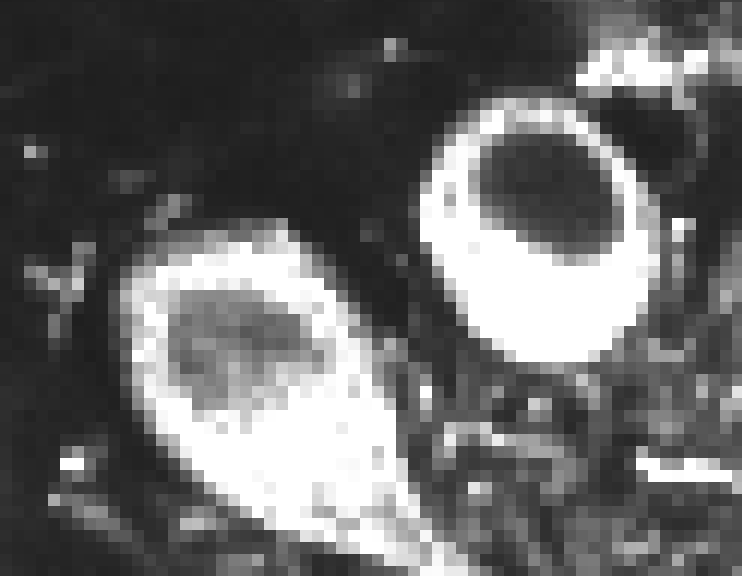
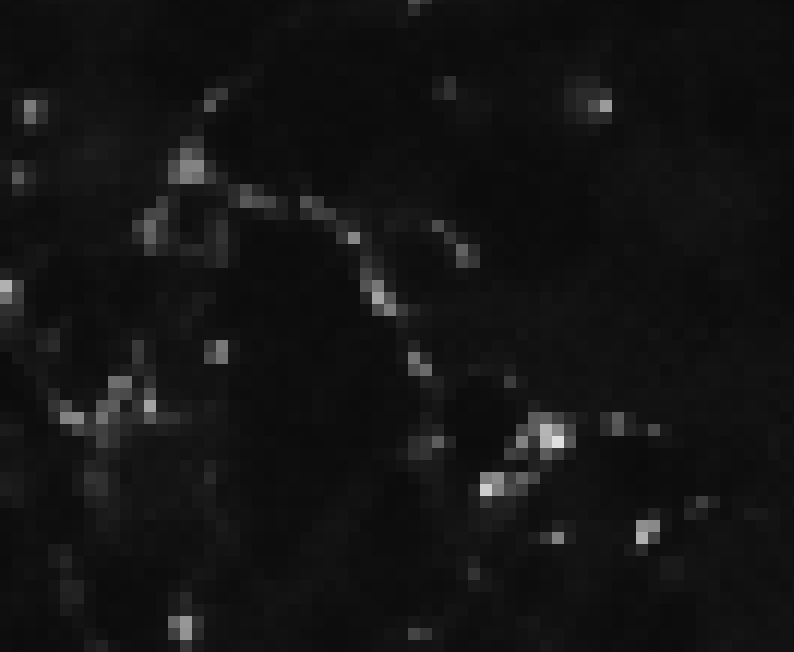
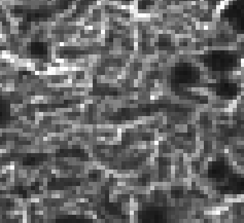

# Segmentation and Pixel Classification 

*Lab authors: Damian Dalle Nogare and Florian Jug* . 

<small>This file last updated 2024-04-07.</small>

---

## **Segmentation** 

### Learning Objectives

- Train a pixel classifier to segment images
- Learn to use ilastik {cite}`Berg2019-no`
- Experiment with how features and data affect performance

Lab Data: [<u>https://tinyurl.com/qi2024labs</u>](https://tinyurl.com/qi2024labs)

---

### Training a Random Forest Pixel Classifier in ilastik

- Welcome to the world of software with good documentation and
  tutorials! Take a deep breath and really soak it in, then check out
  the ilastik pixel classifier tutorial here:
  [<u>https://bit.ly/3x11EZf</u>](https://bit.ly/3x11EZf).  
  Let us know if you hit a snag!

- You can use the data in Machine_Learning/Pixel_Classifier/ (link to
  Lab Data can be found on top of this page!). Note that you’ll need to
  change the axes to “tyx” because these images are not a z-stack.

```{admonition} Question
:class: important

There is a train and a test stack. Why is that?
 ```

- Try to segment the images by providing training examples for four
  classes: 
  

  - Cell bodies: 
    

  - Synapses: 

  - Granule cell layer

  - ...and “*Other stuff*”

- Can you unambiguously define/draw labels for each of the classes?  
  - If not, would that be a problem? Why or why not?

- Pay attention to how the segmentation changes as you add training
  data. Can you understand why it changes as it does? If not ask!

- We learned about this in the lecture - what exactly is this “random
  forest pixel classifier” doing behind the scenes? If it’s not clear,
  ask!

- Using what you learned about filtering, what can you say about the
  features we might need for this segmentation task? What are the
  minimal set that might do? Try that out. If your segmentation needs
  improvement, what features might you need to add?

- When you think you’re done with training, try the model on the test
  image. How does it perform? What does this tell you about your data,
  the model, and how you trained it?

- Start a new pixel classification project with the same data so you can
  play around with how the training data affects the resulting model and
  classification.

  - What happens if you give the model a ton of examples of one class
    and very few examples of the others? Why is that?

  - What happens if you only annotate the brightest cell bodies you can
    find? Why?

---

## **Cell Classification** 

### Learning Objectives

- Segment cells
- Extract features from cells
- Feature-based cell classification

Lab Data: [<u>https://tinyurl.com/qi2024labs</u>](https://tinyurl.com/qi2024labs)

### Segment Nuclei for Feature Extraction

- Start a new project in ilastik using the workflow “Pixel
  Classification + Object Classification”

- Use the file in Machine_Learning/Cell_Classifier/. The first step will
  be to train a pixel classifier to segment the nuclei, just like you
  did in the previous exercise.

- Why do we need to segment the cells before we classify them? Are there
  other approaches that might let us classify cells without segmenting
  them? What are the pros and cons (ask us to discuss if it’s not
  clear!)

- Once you have a good pixel classifier, you can move on to the
  thresholding step to convert your probabilities into a mask.

### Classifying Mitotic and Interphase Cells

- Now, you can follow this tutorial:
  [<u>https://bit.ly/35BXgVx</u>](https://bit.ly/35BXgVx), starting at
  the “From segmentation to objects” step.

- Can you find a minimal set of features that will classify these cells
  into dividing and non-dividing? Does adding more features help? Is
  there any reason we might not want to add *all* the features?

- If you only label cells in the first few frames of the time-series,
  are your classifications accurate at the end? What does this tell you
  about your model? Do you think the model would work well on a
  different image time series? If not, what might improve its
  performance on new data?

---

```{tip}
Did you know that there are ilastik image reading and model running plugins for both [Fiji](https://www.ilastik.org/documentation/fiji_export/plugin) and [CellProfiler](https://plugins.cellprofiler.org/supported_plugins.html)? They can be helpful for complex workflows.

Once you've trained an ilastik classifier, you can also export the images in ilastik's  [batch processor](https://www.ilastik.org/documentation/basics/batch) for your records and/or to interface with downstream programs. See [this tutorial](https://tutorials.cellprofiler.org/#pixel-based-classification) for an example of an ilastik-to-CellProfiler workflow.
```

---

##  **Bonus Exercises - Play with Labkit (pixel classification in Fiji)**

- You find Labkit on an update site called “Labkit”. Ask us if you have
  trouble installing it. Try it with the same training data and see how it performs!

---

## **Bonus Exercises - Challenging Segmentations**

- Pick the hardest image you’ve seen in the course and try to segment it
  using the ilastik RF pixel classifier. Can you crack it? Can you
  understand why or why not?

---

## **Bonus Exercises - Breaking it**

- Can you find an image segmentation or object classification problem
  that you *can’t* solve with ilastik? If you don’t have time to
  actually try it, can you think about what sort of problem might be
  unsolvable by any pixel classification approach?
