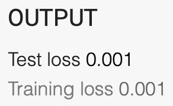
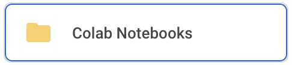
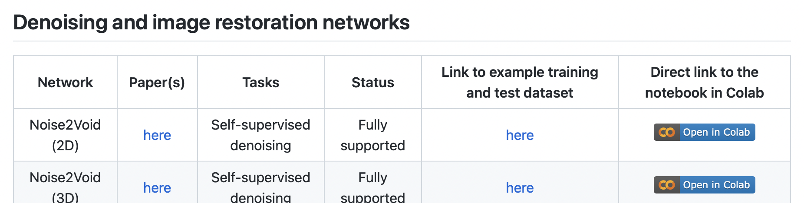
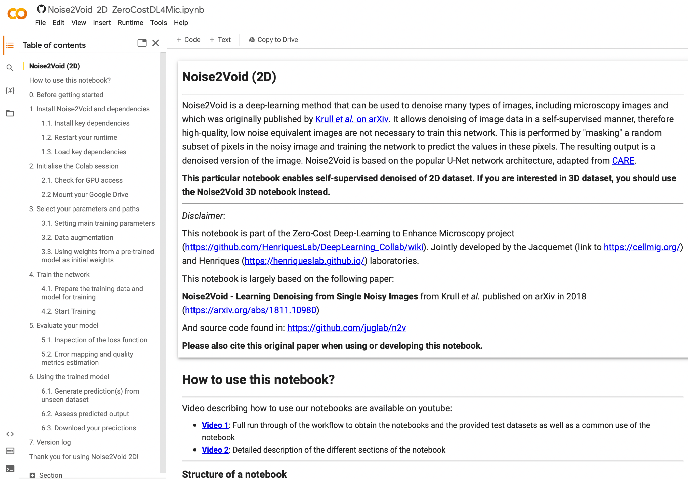
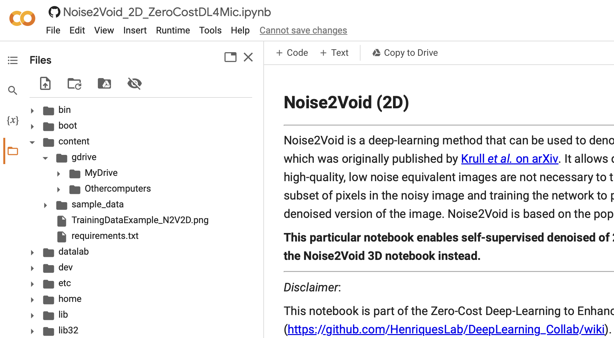
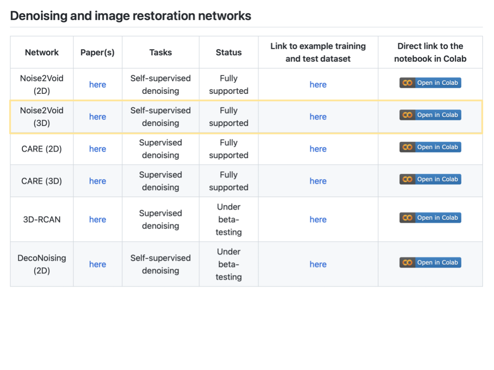
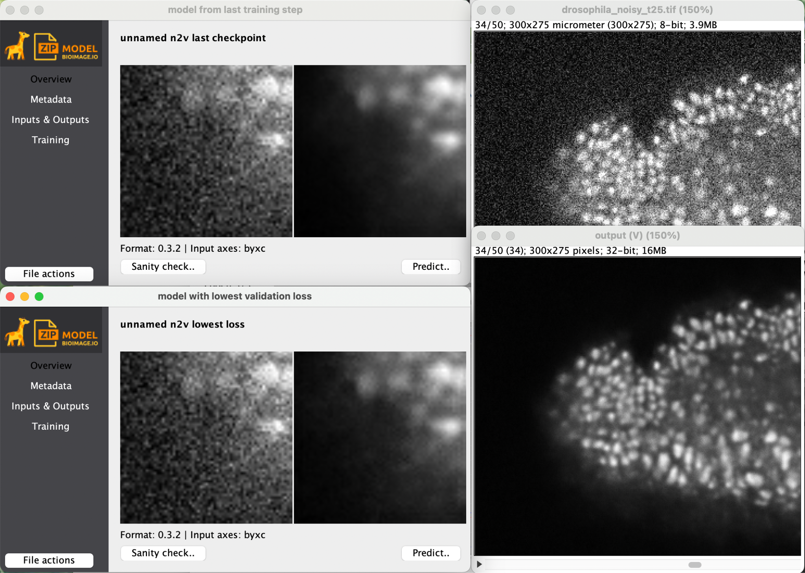

# Deep Learning for Microscopy Image Analysis

*Lab authors: TBU-Hunter Elliott & Marcelo Cicconet* . 

<small>This file last updated 2024-04-01.</small>

---

## Learning Objectives

- [ ] Appreciate how Neural Networks are trained

- [ ] Learn how to get to and use Google Colab

- [ ] Denoising with Noise2Void in “Zero”

- [ ] Segmentation with StarDist in “Zero”

- [ ] Segmentation with Cellpose

Lab Data: [<u>https://bit.ly/3uEFiKg</u>](https://bit.ly/3uEFiKg)

**Overview**

Neural networks can do useful things. Their deployment within
user-friendly tools is, unfortunately, lacking behind. Hence, methods we
would like to apply to our data are not available in Fiji or ilastik
quite yet. The latest methods can only be used by the ones “brave”
enough to expose themselves to some amount of computer source code...

Today we will all be brave! :)

I’m very much looking forward to hearing about your successes and
struggles tomorrow during the Q&A session. Now, please take a seat, open
a browser, and buckle up.

**Table of Contents  
**

[Exercise 1: Remind yourself about what we’ve heard in the lecture
2](#exercise-1-remind-yourself-about-what-weve-heard-in-the-lecture)

[Exercise 2: First steps with Google Colab (don’t waste too much time
here…)
3](#exercise-2-first-steps-with-google-colab-dont-waste-too-much-time-here)

[Exercise 3: First steps with ZeroCostDL4Mic
4](#exercise-3-first-steps-with-zerocostdl4mic)

[Exercise 4: Image Denoising with Noise2Void (in “Zero”)
6](#exercise-4-image-denoising-with-noise2void-in-zero)

[Exercise 5: Image Segmentation with StarDist (in “Zero”)
7](#exercise-5-image-segmentation-with-stardist-in-zero)

[Bonus Exercise: Use Fiji’s Noise2Void Plugin
8](#bonus-exercise-use-fijis-noise2void-plugin)

## Exercise 1: Remind yourself about what we’ve heard in the lecture

1.  Visit
    [<u>https://playground.tensorflow.org</u>](https://playground.tensorflow.org)
    and look around. What terms did you hear before, what is new, and
    what is confusing?

2.  Please try to:

    1.  On the classification example that looks like a tiny
        checkerboard, try to get a test loss of 0.001 or less.  
        

    2.  For the spiral-shaped classification example, try to find a
        network architecture with the smallest amount of nodes (neurons)
        that will drop below 0.01 (1%) test error.  
        
        

    3.  Now switch from ‘Classification’ to ‘Regression’. What is going
        on here? Can you figure out how regression is different from
        classification?  
        

    4.  Some other things to try if you feel it…

- Add some noise to your data. What changes? Why?

- Try to find a setup that overfits. How do you identify overfitting?  
  

  1.  All the important terms and concepts wrt. to training and
      validation are somewhere on this one page. Check if there is
      anything that makes no sense to you and ask us

## Exercise 2: First steps with Google Colab (don’t waste too much time here…)

The following steps should get you started in no time:

1.  Please go to
    [<u>https://drive.google.com</u>](https://drive.google.com) and log
    in with your google account. If you do not have (and do not want
    one), please team up with somebody else who has one(or is willing to
    create one).

2.  If you never used Google Colabs:

    - click on
      \>
      More \> Connect more apps

    - search for “Colaboratory” and connect it to your google account

3.  You should now see a new folder in your google drive:

    - 

Now let’s look at some existing tutorial notebook and play a bit with
it:

1.  Open
    [<u>https://colab.research.google.com/notebooks/intro.ipynb</u>](https://colab.research.google.com/notebooks/intro.ipynb)
    and try to execute the few code cells you’ll find there.

2.  Now open a linear regression example available online and follow it
    until (and including) the section “Simple Linear Regression”.  
    Don’t waste your time today to go any further… it is of course super
    interesting, but totally out of scope… ;)  
    [<u>https://colab.research.google.com/github/jakevdp/PythonDataScienceHandbook/blob/master/notebooks/05.06-Linear-Regression.ipynb</u>](https://colab.research.google.com/github/jakevdp/PythonDataScienceHandbook/blob/master/notebooks/05.06-Linear-Regression.ipynb)

> *Credit:*

3.  *Note:* you can save your own copy of this notebook on your own
    Google Drive via…  
    

## Exercise 3: First steps with ZeroCostDL4Mic

ZeroCostDL4Mic is a collection of (hopefully) self-explanatory Jupyter
Notebooks for Google Colab. They are meant to quickly get you started on
learning how to use deep-learning methods specifically created for
microscopy image analysis.

Google Colab itself provides the computations resources needed and does
so at zero cost. ZeroCostDL4Mic is designed for researchers that have
little or no coding expertise to quickly test, train and use popular
neural networks approaches.

1.  Go to
    [<u>https://github.com/HenriquesLab/ZeroCostDL4Mic/wiki</u>](https://github.com/HenriquesLab/ZeroCostDL4Mic/wiki)

2.  Scroll down and be amazed by the amount of available methods… ;)

3.  You could pick any method now and start playing with… but… why not
    start with “Noise2Void (2D)”?  
      
    Find it, download any example data, then click on “Open in Colab”.
    (Hint: the sample data can also be found behind the “Lab Data” link
    above…)

4.  You will find yourself at a page looking roughly like this:  
    

5.  In order to work on your own data (or also on the test data we
    downloaded just before), please upload it on your Google Drive (in
    any folder you’d like).

6.  While uploading, you can start going through the Noise2Void notebook
    we opened before.

    1.  At some point (at Step 2.2) you will be asked to connect to your
        Google Drive. Please do so! 🙂

    2.  Note that you will now see the content of your google drive.
        Click first on the “Files” icon, then go one folder up, and you
        should see something like this:

> 

3.  **DONE!** Let’s continue in the next exercise…

## Exercise 4: Image Denoising with Noise2Void (in “Zero”)

In this exercise we will denoise some data with Noise2Void. Please
remember, Noise2Void is removing pixel-noises only (Poisson noise,
readout noise, etc.).

If you do not have really noisy data at hand, feel free to use the
example data offered on the ZeroCostDL4Mic wiki (or from within the Lab
Data link from above, or just use
[<u>https://tinyurl.com/DLLab-droso2d</u>](https://tinyurl.com/DLLab-droso2d)).
Ideally, as a group we use a bunch of different datasets, so we have
more results to look at…

1.  Decide what data to use (see remarks above).

2.  Copy the data to any sensible place on your Google Drive.  
    (*Why? Data on Google Drive can be read easily and FAST by Collab…*)

3.  Start the Noise2Void Colab Notebook from Zero (likely you did that
    already in the last exercise, didn’t you?).

4.  Go through the notebook. The first time around this will take a
    while and be confusing at times. Plow through it, you will soon be
    happy!  
    **Ask questions, help each other!**

    1.  *Pro tip:* if you are in a hurry, reduce the number of epochs to
        some small number, e.g. 10 or 20. Results will be much worse,
        but you can always crank that number up later…

    2.  Later today, when you are done with the exercises, you might
        want to re-run your favorite notebook with the suggested number
        of epochs. Collab will work while you have fun on your free
        evening… 🙂

## Exercise 5: Image Segmentation with StarDist (in “Zero”)

Now that you have experienced how to use ZeroCostDL4Mic Collab
notebooks, switch it up, do some instance segmentation! We suggest the
StarDist notebook, but if you feel adventurous, choose something else
you find most interesting in the context of your own research.

Go through the notebook you chose. And again:

1.  **Ask questions, help each other**!

2.  *Pro tip:* reduce the number of epochs to some small number to save
    yourself long waiting times!

3.  Later today, when you are done with the exercises, you might want to
    re-run your favorite notebook with the suggested number of epochs.
    Collab will work while you have fun on your free evening… 🙂

## Bonus Exercise: Use Fiji’s Noise2Void Plugin

In this exercise you will use a Noise2Void plugin in Fiji. You will have
to install it first.

1.  Open Fiji.

2.  Go to Help - Update… - Manage update sites, then check the CSBDeep
    update site and say Close - Apply changes.

3.  Restart Fiji.

4.  Download
    [<u>https://tinyurl.com/DLLab-droso2d</u>](https://tinyurl.com/DLLab-droso2d)
    and open this 2D+t tiff in Fiji.

5.  Start the “N2V train + predict” plugin.

6.  Figure it out… ;)

    1.  ***Please ask question at ANY time**!*

7.  If all works out ok, you will see something like…  
    

8.  The training will likely be VERY slow, but to sweeten up the wait,
    we show you a nice preview.

9.  Together with the result you also get the trained model for later
    reuse.

## Bonus Exercise: Play with CellPose 

Once home, you will need this link to get started:
[<u>https://cellpose.readthedocs.io/en/latest/installation.html</u>](https://cellpose.readthedocs.io/en/latest/installation.html)

Here, at QI, we have taken this annoying step for you already. Hence,
you will find Cellpose pre-installed on the lab computers. To start it,
go to the Windows search next to the start menu, and type “anaconda”.
Pick and start the option “anaconda prompt”.

Once this is opened, type in those two comments (the stuff after
“**\>**”):  
***\>*** conda activate cellpose  
*(cellpose) **\>*** cellpose

You should now see something like
this:

Open the file ‘easy\001_img.tif’ by dragging it onto the open window.
You can find this file in the folder ‘DL4MIA’ in the Lab Data share, or
download it directly via

https://drive.google.com/drive/folders/1BgoUf1f-QfcFNIsppdzTCjehkCAntbyc?usp=share_link

We need to tell cellpose (roughly) how large our objects are (you can do
so via the ‘cell diameter’) field. How might we estimate this? Keep in
mind that this diameter must be reported in pixels.

You can now segment this image by selecting one of the pre-trained
models from within the ‘model zoo’ box. Try segmenting this image using
the ‘cyto’ model. How good are the results?

*Hint:* You can toggle the visibility of segmentation masks on and off
by hitting ‘**x**’ on your keyboard. Similarly, you can toggle cell
outlines with the keyboard shortcut ‘**z**’. Alternatively you can do so
in the ‘Drawing’ tab.

How well did cellpose segment your image? Where (if anywhere) did it
fail? Try some different models from the model zoo box. Do any of these
work better? Worse? Why might that be?

Let’s now try some more challenging data. From the link above, or from
the DL4MIA folder in the lab data share, download the entire folder
named ‘hard’, and place it somewhere convenient (like the desktop).

From within this folder, open the ‘test’ folder and drag the file
test_img.tif to cellpose to open it. Try segmenting it as well as
possible. Can you find setting and a model that work perfectly?

Spoiler, none of the models are perfectly suited to this data, but we
can iteratively retrain a model from within the Cellpose GUI…
interested? Ok, let’s do it! 🙂

**Human-in-the-loop retraining**

In the ‘hard’ folder you download earlier you will find a folder called
‘train’. In this folder you will find a number of images. Open the image
104_img.tif’ in cellpose. Note that we are not going to train a model
from scratch, instead we are going to finetune one of the existing
models (ideally starting from one that does a pretty good job already).
Choose the model that you think gave you the best segmentations in the
previous part of this exercise and apply it to this image.

We are going to iteratively finetune this model, one image at a time.
Once the current image is segmented well, we will open another one and
repeat until results are (hopefully) making us happy! Here a little
sketch:

Everytime we see a result, you can correct the segmentation errors by
redrawing some of the segmentation masks. The corrected image can then
be used to further finetune (retrain) the model.

You can correct errors in one of two ways:

1)  Delete a mask by holding down the ‘control’ key and clicking on it.

2)  Draw a new mask by right-clicking anywhere in the image and tracing
    an outline, ending where you began to draw.

Try correcting some of the segmentations. It might be easier if you
switch between masks and outlines (use ‘z’ and ‘x’ as explained before).

Once you are happy with your corrected masks, take a look in the folder
containing all of the training images. You will notice there is a new
file there, called ‘hard\train\104_img_seg.npy’. This contains your
corrected segmentation and will become a new bit of ground truth used
during finetuning the model. But… how do you start this finetuning step?

In Cellpose, start: ‘models →  
train new model with images and masks in folder’.

You should see a window like this one:

First, we need to select which initial model to use (in the screenshot
above, we are retraining the ‘cyto’ model (but of course you may choose
to retrain any available model). You can, and should, give your new
model a name. You can also see which (corrected) images you are going to
retrain the model on under ‘filenames’, and the number of masks that
will be used for retraining in that image. Click OK whenever you are
ready to retrain and finetune the selected model!

Once done, Cellpose will open the next image in the folder and
automatically use the freshly finetuned model to segment it. You can now
repeat this process as often as needed. Cellpose will in each iteration
finetune the same original model, but will do so with an ever increasing
number of user labeled masks (the ones you have created). Eventually you
will either loose hope or find that Cellpose’s prediction become good
enough for you to be 😻!

Once you are happy with the results you are getting, apply your final
model to the test data we have segmented at the start of the exercise
(importantly: your model has not previously seen this image during
finetuning! Why is this important again?). Is the result better than
with the initial model you started with?
