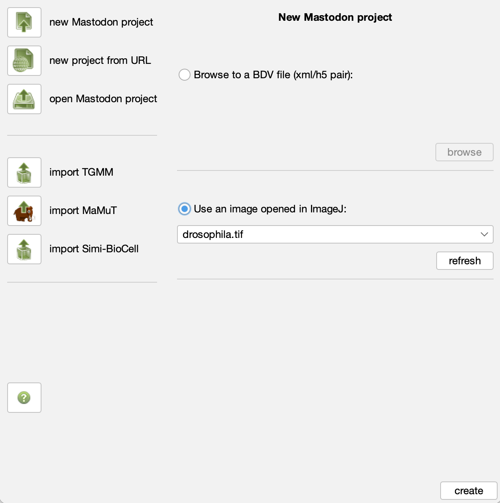
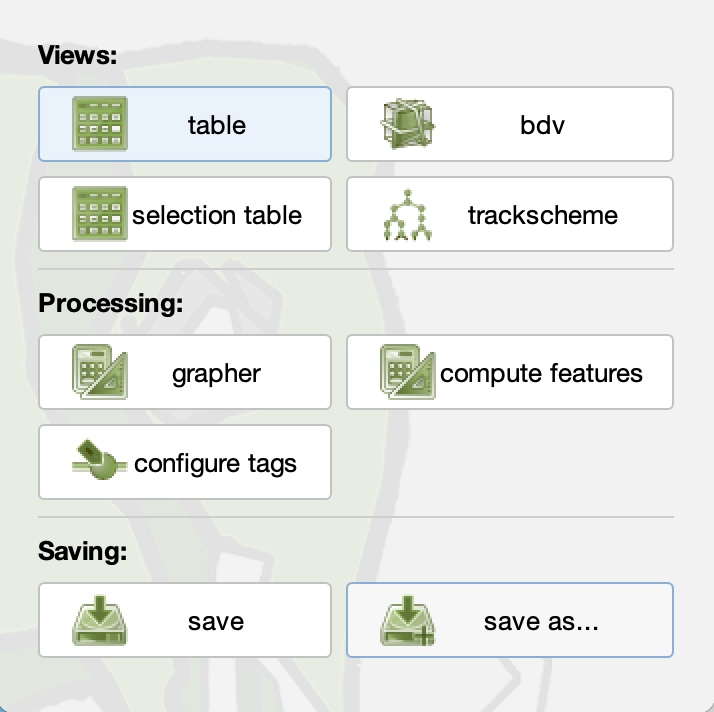

# Image Time Series Analysis

*Lab authors: Hunter Elliott, Damian Dalle Nogare and Florian Jug* . 

<small>This file last updated 2024-04-10.</small>

<!-- Maybe add some UlTrac and/or TracX -->

---

## **Part 1: Photobleaching**

### Learning Objectives

- Apply and scrutinize photobleach correction
- Double-normalized FRAP analysis

Lab Data: [<u>https://tinyurl.com/qi2024labs</u>](https://tinyurl.com/qi2024labs)

---

### Bleach Correction

In this portion of the lab, you will compensate for photobleaching by
fitting an exponential model to the decaying fluorescence intensity, and
then correcting for this decay.

Load the data:

- Go to folder BleachCorrection

- Load TRITC into Fiji by dragging the folder into the Fiji window
  (click yes when asked to open as a stack, but leave the checkboxes
  unchecked).

Apply Fiji's built-in photobleach correction plugin

- `Image > Adjust > Bleach Correction`

- Correction Method: Exponential Fit. Press OK.

- This plugin outputs a corrected image as well the fitted exponential
  decay. Since you have not selected an ROI it is using the average
  intensity in the entire image to perform the correction. Have a look
  at the corrected image: does it look like what you would expect?

- You can select a region and measure its intensity over time by drawing
  an ROI and then going to `Image > Stacks > Plot Z Axis Profile` (since
  there’s no Z axis this will actually plot a profile over time). Make a
  measurement like this of the center of a nucleus as well as the
  background. What do you see?

- Now, re-load the original dataset and select an ROI of a nucleus. Be
  sure it stays on the nucleus during the entire time series! Now
  perform the photobleach correction again. What do you see now? Why is
  this? What is the “right” way to photobleach correct these images?

- Make a note of the decay rate (parameter 'b') from the exponential
  fit.

- Repeat for the FITC channel. Which image is bleaching faster?

- How well does the correction work on the FITC channel? Do we need to
  select an ROI here? Why or why not?

- We now have approximately the same average intensity at the end of the
  FITC time series. Is the SNR the same at the beginning and end? Does
  the photobleach correction affect the SNR?

### FRAP

In this lab we will be using a FRAP plugin for Fiji. Unfortunately it does not work on the most current version of Fji (Welcome to the world of research software, you should be used to this by now!). Inside the data folder for this lab, we have included a compatible version of Fiji with the plugin already installed in a folder called `Fiji_for_FRAP`. 

- Load the data: FRAP/33108 SU295 try1.tif (Or use your own if you
  prefer)

- Create an ROI over the square bleached region. Add it to the ROI
  Manager (press ‘t’).

- Plot the intensity in this region over time 
  (`Image > Stacks > Plot Z-axis Profile`)

- Does the intensity recover to a stable value?

- Could we use a photobleaching correction like in the previous
  exercise? Why or why not?

Now we will run the FRAP plugin. You can find this under the plugin menu, under `FRAP profiler v2`. This is going to apply a similar analysis that you did above: photobleach correction, and then exponential fitting, but it will do it using a double-normalization approach. 

- First, perform a *uniform* background subtraction on your images by
  measuring the mean intensity in a region of the background and then
  going to `Process > Math > Subtract`. Why do we want to do a uniform
  subtraction rather than e.g. a rolling ball?

- You will need to have two ROIs in the ROI Manager. One for the square
  bleached region, and a second ROI for the whole cell (including the
  frapped region). If you can’t include the whole cell, just include a
  large region of the same cell which includes the frapped region. When
  might this non-whole-cell ROI be OK? When might it be problematic?

- Launch the FRAP Profiler plugin (`Plugins > FRAP Profiler v2`).

- Enter the correct time interval, so that your recovery rate is in the
  correct units.

- Run first with a single exponential. Compare the fitted curve to the
  raw data in the figure that is created (in the procFRAP and normFRAP
  windows). (Ideally we would compare this quantitatively but the plugin
  doesn’t support this :( )

- Re-run the plugin with double exponential. Is the fit better? A double
  exponential models a two step process, e.g., fast but weak association
  of the molecule of interest, followed by slower stronger association.

- What is the % mobile?


## **Part 2: Tracking**

### Learning Objectives

- (Semi-)automated Tracking with Mastodon in Fiji
- Using Trackmate{cite}`Tinevez2017-fb` from within Mastodon
- Tracking with ilastik{cite}`Berg2019-no`
- Bonus: exporting from ilastik, editing in Mastodon - note from Beth - this isn't there

---

### Overview

Tracking is an unsolved problem. It can be easy, but it usually is not.
If you need to reach flawless results, you have to curate manually.

This being said, manual tracking is very time consuming and
boring/annoying. Hence, we will be exploring semi-automatic tracking
regimes and also see how automated results can then be loaded for manual
curation.

More specifically, we will get to know ***Mastodon*** and learn more
about ***ilastik***. Mastodon is a Fiji plugin designed to deal with
truly huge time-lapses, which makes it an exquisitely valuable choice
for many tracking projects.

We know ilastik already from other exercises, but today we will explore
some of ilastik’s tracking features. The automated tracking in ilastik is
quite involved. Some key ideas we discussed in the lecture.

```{note}
This lab is intended to be interactive. If you find
something cool… don’t hold back… share it with others. These tools are
rather complex and we will certainly not be able to see all their
features.
```

### Get the data we need

Please start to download the following data (you can also find it in the
LabData folder on our google drive):

1.  Drosophila.tif -
    [<u>http://tinyurl.com/yy5nsuce</u>](http://tinyurl.com/yy5nsuce)

2.  2D+t tracking example for ilastik:
    [<u>http://tinyurl.com/y67af3mz</u>](http://tinyurl.com/y67af3mz)

3.  3D+t tracking example for ilastik:
    [<u>http://tinyurl.com/y4sdzg9p</u>](http://tinyurl.com/y4sdzg9p)

### (Semi-)automated Tracking in Mastodon

***Required:** Fiji + Mastodon + drosophila.tif*

```{important}
Collect screenshots or remember what you learned here.
Be prepared to show the coolest thing you found out tomorrow morning
(you absolutely will be volunteered to share your findings).
```

#### Step 1: Start a Mastodon project from a single tiff File

1.  Put the file ‘drosophila.tif’ in some folder. Link to download this
    file can be found further up.

2.  In Fiji do: `Help > Update > Manage update sites`

    - Check boxes next to “Mastodon”.

    - `Close > Apply changes` and restart Fiji

3.  Open ‘drosophila.tif’ in Fiji.

4.  In Fiji, start Mastodon by `Plugins > Mastodon`

5.  In Mastodon, start a new project by clicking “new Mastodon project”.

    - Click on “use an image open in ImageJ” and select the drosophila
      you just opened in Fiji.

> 

- Click on “create” to create the new Mastodon project. A new window
  will open.

> 

- In this new window, you can now open BDVs and TrackSchemes by clicking
  the respective buttons.

6.  Please try to navigate the data and play with a few BDV shortcuts.
    Navigating 3D space can be confusing and a few shortcuts are really,
    really valuable. Here a quick reminder to what we’ve seen yesterday:

    - If you left click and drag, you can reslice in arbitrary
      directions.  
      Note the overview sketch on the top left… very helpful!

    - Right click and drag is moving the volume around.

    - Shift + X/Y/Z is rotating between the three exes parallel
      directions. Also here these rotations happen around the current
      mouse location.

    - The mouse wheel is shifting the visible image plane in and out.

    - Shift + ctrl + mouse wheel (on windows) is zooming in and out.

    - Spend some additional time to internalize some more shortcuts:  
      [<u>https://imagej.net/BigDataViewer#Basic_Navigation</u>](https://imagej.net/BigDataViewer#Basic_Navigation)

#### Step 2: Manually track some cells

1.  Get the Mastodon cheat sheet:
    [<u>http://tinyurl.com/y2rxfhlv</u>](http://tinyurl.com/y2rxfhlv)

2.  Figure out how to:

    1.  Manually add cell detections (**a**)

    2.  Change their size to better fit the data (**q/e**)

    3.  Move detections around (**hold space + drag**)

    4.  Look at the detections you created using the TrackSceme view

    5.  Link detections across time (**hold L + drag**)

        1.  Do this in TrackScheme

        2.  Do this in one in a BDV window

    6.  Delete detections/links (**d**)

    7.  Figure out what the lock symbols in the top left of each view
        window are for…

    8.  Figure out what the ‘context’ in a TrackSceme controls (you will
        need to have tracked some lineages for this).

    9.  Did you spot the undo function yet? (**Ctrl + z**)

    10. Ask yourself how long it would take to manually track every
        single nucleus in this really quite small dataset. Once this
        sunk in, pity everyone who has to do that for his/her project.

#### Step 3: Semi-automatic tracking to speed things up

1.  Get some instructions:
    [<u>http://tinyurl.com/y39vgnuy</u>](http://tinyurl.com/y39vgnuy)
    (warning, they are slightly outdated, screenshots will look a bit
    different than the Mastodon you are using today…)

2.  Now speed up your tracking work and try to find an efficient way to
    navigate Mastodon. (Remember, tomorrow we will volunteer people to
    show and compare found ways to track fast and efficiently…)

#### Step 4: Automatic tracking using the TrackMate plugin

1.  Use (in Mastodon, **not** Fiji): `Plugins > Tracking > Detection…`
    and detect cells in some part of the volume (the ROI-box to select a
    part can also be using from within BDV).

2.  Then use: `Plugins > Tracking > Linking…` and link those detections
    to each other. This will not lead to perfect results. Don’t worry
    about that!

3.  Play with options, check if you can improve results somehow.

### Tracking in ilastik

Please go to
[<u>https://ilastik.github.io/documentation/tracking/tracking</u>](https://ilastik.github.io/documentation/tracking/tracking)
and follow the instructions on this page.

Since downloads from the ilastik website can be slow. If so, please use
the following links to get the sample data and projects (*likely you
have downloaded this in Exercise 0 already, no need to download it
again*):

1.  2D+t tracking example for ilastik:
    [<u>http://tinyurl.com/y67af3mz</u>](http://tinyurl.com/y67af3mz)

2.  3D+t tracking example for ilastik:
    [<u>http://tinyurl.com/y4sdzg9p</u>](http://tinyurl.com/y4sdzg9p)

The 2D example will be way faster to work with, but please choose any of
the two. After the download is completed, unzip the file and open
“***conservationTracking.ilp***” in ilastik (double click should do it).

Please collect some screenshots or remember what you liked most. Be
prepared to show the coolest thing you found out tomorrow morning. Some
of you will be volunteered to share their findings… ;)

Some things to try after you start feeling comfortable with ilastik.
There is much more interesting stuff to explore. Here some inspiration:

1.  For the 2D+t example…

    1.  Can you spot some cells in the last time-point that are actually
        mergers of more than 2 cells? Can you change this somehow and
        make ilastik also detect mergers of more then 2 objects?

    2.  Please play with the individual steps and observe the many image
        layers. Which one might be particularly useful? When?

2.  For the 3D+t example…

    1.  How long did it take to track automatically? Is there a way to
        speed this up? (Ask the online manual…)


### Tracking with btrack in napari

In napari, there is a quite capable plugin for object tracking called `btrack`.
Let us install it and then use it.

**Installation of btrack and napari from scratch**
- Open a Anaconda Prompt and install all we need by executing...
  - `conda create -n btrack`
  - `conda activate btrack`
  - `conda install pip`
  - `pip install btrack[napari]`
  - `pip install -U napari[all]`

**Using btrack to track objects we segmented**
- Next, we need a dataset to track. Actually, we need not only a dataset, we need
  data that is segmented. Since we learned about segmentation before, here we will
  simply use one of the btrack example datasets. 
  You can find a file called `segmented_nuclei.tif` it in the folder `btrack_masks`.
- Start btrack by starting napari (execute `napari` from within the *btrack* conda 
  environment we installed above).
- Start btrack via `Plugins > Track (btrack)`.
- Drag and drop the masks file into napari.
  ```{warning}
  napari does not recognize this tiff file as labels. You must manually convert 
  to labels by right clicking on the layer and select `Convert to labels`.
  ```
- In the btrack side-bar, select the segmentation masks in the freshly coverted labels 
  layer and click on `Track`.
- Since this is one of the canned examples of btrack, the result is naturally quite good.
  If you have any labels for any other dataset - try it!
- The real work starts now: after objects are tracked, how would we continue analyzing 
  these tracks?

```{tip}
Tracking in napari is a thing. Kind of. 
If you want to learn more about it, maybe this is a good place to start:
[https://focalplane.biologists.com/2023/06/01/tracking-in-napari/](https://focalplane.biologists.com/2023/06/01/tracking-in-napari/)
```